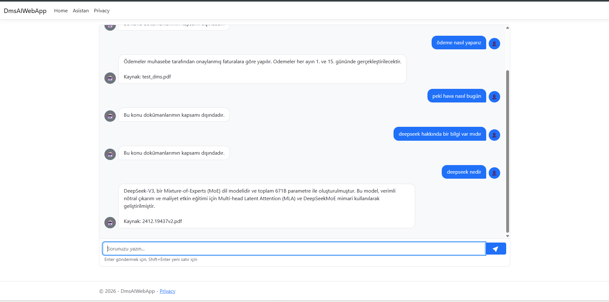
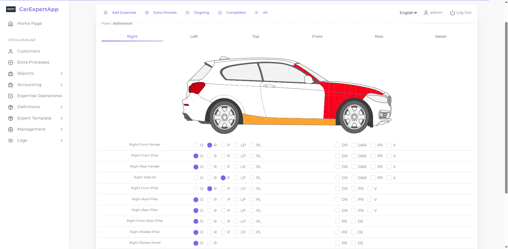
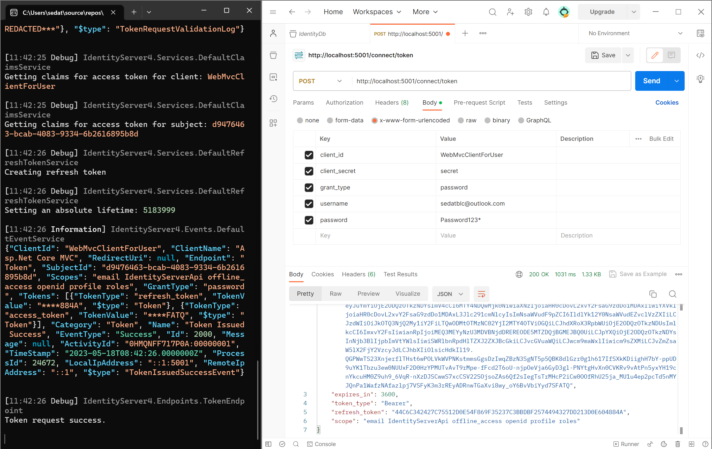
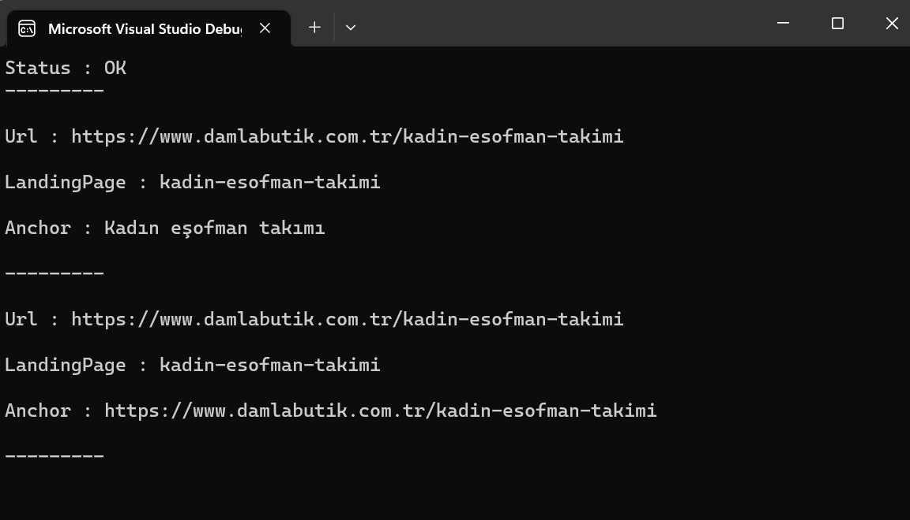

# 🚀 My Projects Portfolio

---

<table>

<tr><td>
<table><tr>
<td width="300" valign="top"></td>
<td valign="top" style="padding-left:16px">

### ⭐ DmsAIChatBot
   

Local RAG document assistant — upload PDFs and query them in natural language. Runs fully offline with Ollama (LLM + embeddings), Qdrant vector search, and ASP.NET Identity for auth and role/claim management.

[→ View Project](https://github.com/sedatbilece/DmsBot)

</td>
</tr></table>
</td></tr>

<tr><td>
<table><tr>
<td width="300" valign="top"></td>
<td valign="top" style="padding-left:16px">

### ⭐ CarExpertApp

Web app for digitalizing automotive appraisal processes — authorization, customer management, appraisals, and reporting.

[→ View Project](https://github.com/sedatbilece/CarExpertApp)

</td>
</tr></table>
</td></tr>

<tr><td>
<table><tr>
<td width="300" valign="top"></td>
<td valign="top" style="padding-left:16px">

### ⭐ Flow Launcher Terminal Shortcuts Plugin
 

A Flow Launcher plugin that opens a terminal in a configured directory and optionally runs a command when an abbreviation is typed.

[→ View Project](https://github.com/sedatbilece/Flow.Launcher.Plugin.TerminalShortcuts)

</td>
</tr></table>
</td></tr>

<tr><td>
<table><tr>
<td width="300" valign="top"></td>
<td valign="top" style="padding-left:16px">

### ⭐ YT Music Playlist Downloader
 

Windows desktop app that downloads YouTube & YouTube Music playlists as MP3 files using yt-dlp and ffmpeg.

[→ View Project](https://github.com/sedatbilece/YTMusicPlaylistDownloader)

</td>
</tr></table>
</td></tr>

<tr><td>

<!-- thumbnail:  -->

### ⭐ Workout Tracker
 

Native iOS application for tracking workout activities, built with Swift.

[→ View Project](https://github.com/sedatbilece/workout-tracker)

</td></tr>

<tr><td>
<table><tr>
<td width="300" valign="top"></td>
<td valign="top" style="padding-left:16px">

### ⭐ SignalR Restaurant Project
 

Basic CRUD app with real-time frontend updates using SignalR.

[→ View Project](https://github.com/sedatbilece/SignalRProject)

</td>
</tr></table>
</td></tr>

<tr><td>
<table><tr>
<td width="300" valign="top"></td>
<td valign="top" style="padding-left:16px">

### ⭐ Turkish Number To Integer Converter API
 

Converts numbers written in various Turkish formats to their numeric equivalents.

[→ View Project](https://github.com/sedatbilece/TurkishNumberToIntegerConverterAPI)

</td>
</tr></table>
</td></tr>

<tr><td>
<table><tr>
<td width="300" valign="top"></td>
<td valign="top" style="padding-left:16px">

### ⭐ LawFirmTemplate
 

Law firm promotion website with dynamic feature fields.

[→ View Project](https://github.com/sedatbilece/LawFirmTemplate)

</td>
</tr></table>
</td></tr>

<tr><td>
<table><tr>
<td width="300" valign="top"></td>
<td valign="top" style="padding-left:16px">

### ⭐ MicroService-CourseApp
 

Microservice architecture for course purchasing and related transactions.

[→ View Project](https://github.com/sedatbilece/MicroServices-CourseApp)

</td>
</tr></table>
</td></tr>

<tr><td>
<table><tr>
<td width="300" valign="top"></td>
<td valign="top" style="padding-left:16px">

### ⭐ ElasticSearch based API
 

Elasticsearch requests via NEST library on .NET Core.

[→ View Project](https://github.com/sedatbilece/ElasticSearchWithNet)

</td>
</tr></table>
</td></tr>

<tr><td>
<table><tr>
<td width="300" valign="top"></td>
<td valign="top" style="padding-left:16px">

### ⭐ RabbitMQ Watermark & Excel App
 

RabbitMQ messaging with BackgroundService (Watermark) and WorkerService (Excel).

[→ View Project](https://github.com/sedatbilece/RabbitMQ-Apps)

</td>
</tr></table>
</td></tr>

<tr><td>
<table><tr>
<td width="300" valign="top"></td>
<td valign="top" style="padding-left:16px">

### ⭐ WebLinkSearcher
 

Console app that reads a web page and extracts all links.

[→ View Project](https://github.com/sedatbilece/WebLinkSearcher)

</td>
</tr></table>
</td></tr>

<tr><td>
<table><tr>
<td width="300" valign="top"></td>
<td valign="top" style="padding-left:16px">

### ⭐ Identity MVC Membership App
 

Sample app demonstrating .NET Core Identity membership system.

[→ View Project](https://github.com/sedatbilece/.Net-Core-Identity-MVC)

</td>
</tr></table>
</td></tr>

<tr><td>

<!-- thumbnail:  -->

### ⭐ Entity Framework Core 6
 

Code samples and exercises for learning Entity Framework Core.

[→ View Project](https://github.com/sedatbilece/Entity-Framework-Core-6)

</td></tr>

<tr><td>
<table><tr>
<td width="300" valign="top"></td>
<td valign="top" style="padding-left:16px">

### ⭐ Onboarding Library

Onboarding components built with the internship trainee team.

[→ View Project](https://github.com/sedatbilece/jotform-internteam-project)

</td>
</tr></table>
</td></tr>

<tr><td>

<!-- thumbnail:  -->

### ⭐ Spring-Hoaxify API

Social media API with Post/Put/Get, ResponseEntity, and error handling.

[→ View Project](https://github.com/sedatbilece/Spring-Hoaxify)

</td></tr>

<tr><td>

<!-- thumbnail:  -->

### ⭐ Hoaxify Frontend

Frontend for a basic social media app (Hoaxify).

[→ View Project](https://github.com/sedatbilece/Hoaxify-Frontend)

</td></tr>

<tr><td>

<!-- thumbnail:  -->

### ⭐ Undo Dots Canvas App

Click to create dots on canvas; undo via history management.

[→ View Project](https://github.com/sedatbilece/React-Undo-Dots)

</td></tr>

<tr><td>

<!-- thumbnail:  -->

### ⭐ Basic QuestApp API

Basic Spring Boot API built for learning purposes.

[→ View Project](https://github.com/sedatbilece/Spring-QuestApp)

</td></tr>

<tr><td>
<table><tr>
<td width="300" valign="top"></td>
<td valign="top" style="padding-left:16px">

### ⭐ Autocomplete Search

Auto-complete search with dynamic data from backend/db.

[→ View Project](https://github.com/sedatbilece/React-Autocomplete-Search)

</td>
</tr></table>
</td></tr>

<tr><td>

<!-- thumbnail:  -->

### ⭐ Firebase Authentication
 

Firebase authentication integration in a React app.

[→ View Project](https://github.com/sedatbilece/React-Firebase-Auth)

</td></tr>

<tr><td>
<table><tr>
<td width="300" valign="top"></td>
<td valign="top" style="padding-left:16px">

### ⭐ N Layer API
 

Product and category management with 3-layer architecture.

[→ View Project](https://github.com/sedatbilece/.NET-Core-NLayer-API)

</td>
</tr></table>
</td></tr>

<tr><td>
<table><tr>
<td width="300" valign="top"></td>
<td valign="top" style="padding-left:16px">

### ⭐ Spotify Clone
 

Spotify UI clone built with React and Tailwind CSS.

[→ View Project](https://github.com/sedatbilece/React-Spotify-Clone)

</td>
</tr></table>
</td></tr>

<tr><td>

<!-- thumbnail:  -->

### ⭐ CodeBooks Blog Website
 

CRUD blog with EF, Authentication, CKEditor. Ready template modified for frontend.

[→ View Project](https://github.com/sedatbilece/CodeBooks)

</td></tr>

<tr><td>

<!-- thumbnail:  -->

### ⭐ Weather App

Weather app using Fetch API and React Hooks.

[→ View Project](https://github.com/sedatbilece/React-Weather-App)

</td></tr>

<tr><td>

<!-- thumbnail:  -->

### ⭐ Onboarding Tour

Dynamic onboarding card with repositioning, title, and text steps.

[→ View Project](https://github.com/sedatbilece/React-Onboarding-Tour)

</td></tr>

<tr><td>

<!-- thumbnail:  -->

### ⭐ Notes App
 

Console-based note-taking application using Node.js.

[→ View Project](https://github.com/sedatbilece/Notes-App)

</td></tr>

<tr><td>

<!-- thumbnail:  -->

### ⭐ RESTful API
 

RESTful API built with PHP and Laravel.

[→ View Project](https://github.com/sedatbilece/PHP/tree/master/LaravelProjects/first-app)

</td></tr>

<tr><td>

<!-- thumbnail:  -->

### ⭐ Image List App
 

Fetches and displays images from an API. Covers binding, forms, and component communication.

[→ View Project](https://github.com/sedatbilece/React-Projects/tree/master/imagelist-app)

</td></tr>

<tr><td>

<!-- thumbnail:  -->

### ⭐ Blog Project with Layered Architecture

Layered architecture blog project built with .NET Core 5.0.

[→ View Project](https://github.com/sedatbilece/ASP.NET-Core-5.0-Blog-Project)

</td></tr>

<tr><td>

<!-- thumbnail:  -->

### ⭐ Shopping Project
 

E-commerce shopping project built with PHP.

[→ View Project](https://github.com/sedatbilece/Shopping-Project)

</td></tr>

<tr><td>

<!-- thumbnail:  -->

### ⭐ CV Website Project

Personal CV website built with ASP.NET MVC5.

[→ View Project](https://github.com/sedatbilece/CvProject)

</td></tr>

<tr><td>

<!-- thumbnail:  -->

### ⭐ N Layer API Project
 

N-layer architecture API project.

[→ View Project](https://github.com/sedatbilece/NLayerProject)

</td></tr>

<tr><td>

<!-- thumbnail:  -->

### ⭐ Image Uploading

Image upload handling and path management in .NET Core MVC.

[→ View Project](https://github.com/sedatbilece/asp.net-core-image-uploading)

</td></tr>

<tr><td>

<!-- thumbnail:  -->

### ⭐ Text Editor (CKEditor)

Integration of CKEditor rich text editor into .NET Core MVC.

[→ View Project](https://github.com/sedatbilece/asp.net-core-texteditor-using)

</td></tr>

<tr><td>

<!-- thumbnail:  -->

### ⭐ Market Project

Market app with categories and food items.

[→ View Project](https://github.com/sedatbilece/CoreAndFood)

</td></tr>

<tr><td>

<!-- thumbnail:  -->

### ⭐ Company Automation Project

Company automation system developed alongside a tutorial series.

[→ View Project](https://github.com/sedatbilece/asp.net-core-company-automation-project)

</td></tr>

<tr><td>

<!-- thumbnail:  -->

### ⭐ Library Project

First ASP.NET Core testing project — a library management app.

[→ View Project](https://github.com/sedatbilece/asp.net-core-library-project)

</td></tr>

<tr><td>

<!-- thumbnail:  -->

### ⭐ My First Web Page
 

First ever web project — built with pure HTML and CSS.

[→ View Project](https://github.com/sedatbilece/my-first-page)

</td></tr>

</table>
